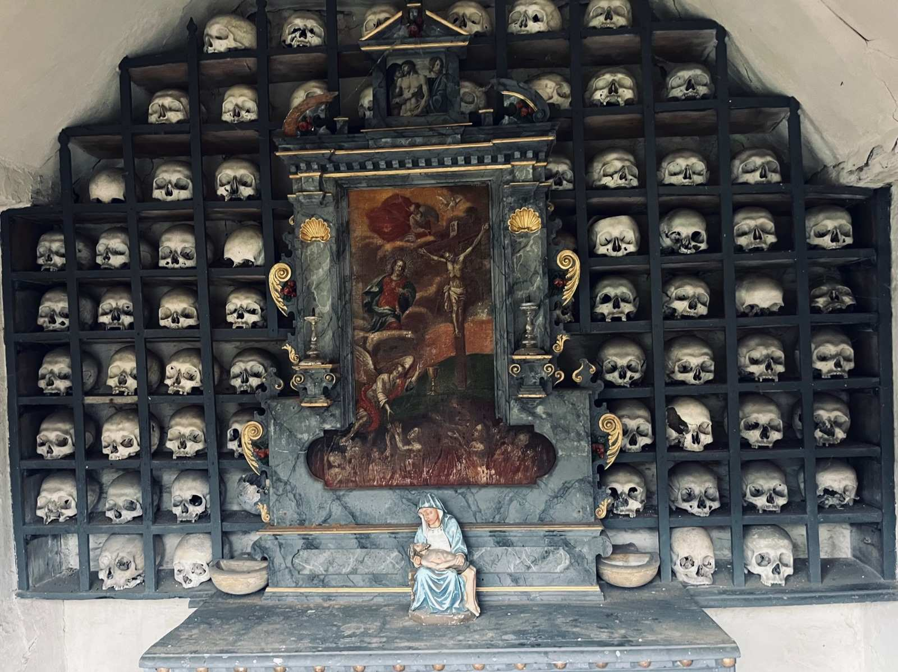

+++
title = "Das letzte Gebet"
date = "2024-02-14"
draft = false
pinned = false
image = "hihi.png"
description = "\n\n\n\n"
+++
 Früher belebten über dreissig junge Schwestern das Kloster Namen Jesú. Heute sitzen noch fünf am oberen Ende des langen Tisches. Für junge Generationen kommen solche lebenslangen Verpflichtungen heute nicht mehr in Frage. So schwer es ist: Das Ende der Gemeinschaft rückt näher. Doch wie gehen die Schwestern damit um und was heisst das für das geschichtsträchtige Gebäude?

Mia Flühmann und Line Gmür 

Läuten der alten Glocke hallt durch weitläufige Gänge. Mit dem letzten Schlag kehrt wieder Stille ein. Eine Stille, die für die Bewohnerinnen dieses Gemäuers Alltag ist. Kurze Zeit darauf hört man von verschiedenen Seiten schlurfende Schritte, die alle das gleiche Ziel haben: das Gebetszimmer. In einem Zimmer mit Wänden, die dem Raum einen holzigen Geruch verleihen, finden sich die Frauen ein. Bedächtig verbeugt sich eine nach der anderen vor dem Kreuz, bevor sie auf den kissenlosen Holzbänken platz nehmen. Bis auf Husten und Atmen ist nichts zu hören. Diese Ruhe wirkt auf andere eher befremdlich oder gar mystisch. Als letzte betritt Frau Mutter, die Oberin, den Raum. Sie nimmt als Einzige auf einem gepolsterten Stuhl platz und läutet mit der Klangschale das Mittagsgebet im Kloster Namen Jesú in Solothurn ein.